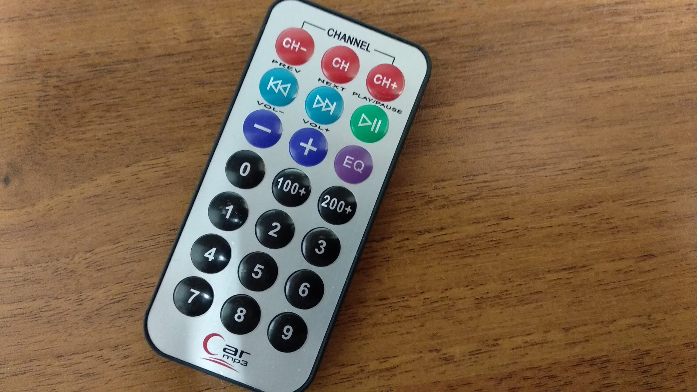

# embedded-weather-station

##General info
Software was developed by Krzysztof Bieniasz and Arkadiusz Jurczak during embedded systems course at 5th semester of Computer Science at AGH UST.
Embedded weather station is small device that enables to measure temperature and humidity. Results can be viewed in Web browser. Furthermore there is feature to set temperature and humidity limit with IR remote control.

##Hardware
We use ESP32-DevKit and few sensors like Dallas temperature sensor or DHT11 humidity sensor.

##Getting started
We advise to use Arduino IDE - it very simple. In our program we uses several different libraries, usually to handle with sensors. To use them You should move them from libraries folder in this repo to Arduino libraries folder in Your device.

##Manual
In current version of software You have to connect esp to Your computer and run program in Arduino IDE. In console device prints IP address that you should write in Web browser.

Diagram explaining use of remote control:

##Documentation
Complex documentation (in polish) are available in documentation.pdf

